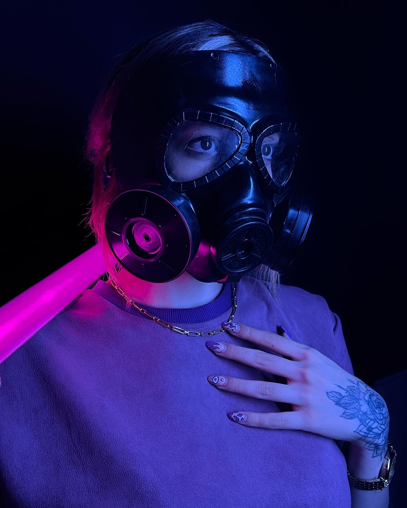

 
 
  <h1> Greetings, Future Innovator! </h1>
  <h2> Step into my realm </h2>

  <h3> My Languages:   
    </h3>
    <h3> Software Skills: 
      </h3>
  
<h3>Contact me:</h3> 
   
    
   

  

  
  
  
  
  

 Abaut me:</h3>

- 🔭 I’m currently working on Frontend Website Design

- 🌱 I’m currently learning professional JavaScript

- 👯 I’m looking to collaborate on frontend web design projects that focus on user experience and responsive layouts.

